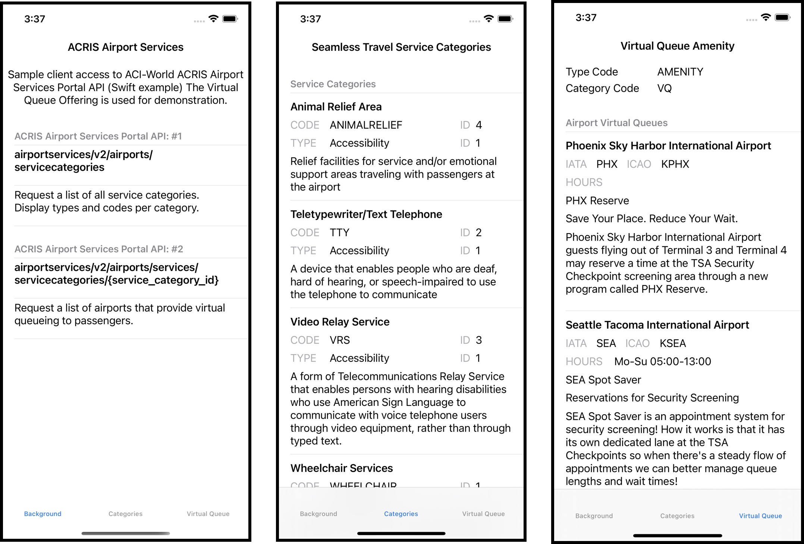

# Services Portal
Information and sample code to assist third party developers when building mobile apps that use the ACRIS Airport Services Portal API

## Description: 
This respository contains Apple Xcode project artifacts (Swift), which illustrate basic use of information from the ACI-World ACRIS Airport Services Portal. The sample project is a template for third parties developing applications wanting to advertise the use of an airport security checkpoint virtual queuing implementation. The data inlcudes airport related information and several URLs to simplify access to an airport's virtual queuing solution.


[](https://opensource.org/licenses/MIT)

## Table of Contents
* [General Info](#general-information)
* [Technologies Used](#technologies-used)
* [Features](#features)
* [Screenshots](#screenshots)
* [Architecture](#architecture)
* [Setup](#setup)
* [Usage](#usage)
* [Project Status](#project-status)
* [Room for Improvement](#room-for-improvement)
* [Acknowledgements](#acknowledgements)
* [Contact](#contact)
<!-- * [License](#license) -->
## General Information
- Provide general information about your project here.
  - Sample code used to a access an industry standard RESTful API.  
- What problem does it (intend to) solve?
  - Code snipits can be used to accelerate development of mobile applications.
- What is the purpose of your project?
  - The goal was to help developers build mobile apps faster by reducing their learning curve.
- Why did you undertake it?
  - ACRIS is an important informaiton sharing resource for the airport industry.
<!-- You don't have to answer all the questions - just the ones relevant to your project. -->
## Technologies Used
- Xcode=13.3 
- Swift=5.5
- IOS=15.4
- ACRIS-AGIM-Concessions-and-Seamless-Travel=2.0
## Features
List the ready features here:
- Illustrates two RESTfull interfaces
  - airportservices/v2/airports/servicecategories
  - airportservices/v2/airports/services/servicecategories/{service_category_id}
- Contains examples of conversion from JSON raw data to Swift useable data structures
- Very simple IOS application
## Screenshots
Not applicable.

<!-- If you have screenshots you'd like to share, include them here. -->
## Architecture

<!-- If you have screenshots you'd like to share, include them here. -->
## Setup
What are the project requirements/dependencies? Where are they listed? A requirements.txt or a Pipfile.lock file perhaps? Where is it located?
- git clone the publi repository 
```
git clone https://github.com/parttimehacker/services_portal.git
```
## Usage
You need to decide whether you want to manually run the application or have it started as part of the boot process. I recommend making a **Raspbian OS systemd service**, so the application starts when rebooted or controled by **systemctl** commands. The **systemd_script.sh** creates a admin directory in **/usr/local directory**. The application files are then copied to this new directory. The application will also require a log file in **/var/log directory** named asset.log.
### Manual or Command Prompt
To manually run the application enter the following command (sudo may be required on your system)
```
sudo python3 asset.py --mq MQTTBROKERSERVER --lt LOCATIONTOPIC -ws DJANGOWEBSERVER
```
- MQTTBROKERSERVER is the host name or IP address of MQTT broker. I use the Open Source Mosquitto broker and bridge.
- LOCATIONTOPIC is the MQTT topic name for the location of the server. 
- DJANGOWEBSERVERis the host name or IP address of RESTful API web server. I use django to host my local DIYHAS web site.

## Implementation Status

## Room for Improvement
Include areas you believe need improvement / could be improved. Also add TODOs for future development.
- Further refactoring to more generalize the class
To do:
- Integrate into other DIYHA applications and repositories
- Develop a new installation process for seperate repositories
## Acknowledgements
Give credit here.
- My "do it yourself home automation" system leverages the work from the Eclipse IOT Paho project. https://www.eclipse.org/paho/
- Many thanks to...
## Contact
Created by [@parttimehacker](http://parttimehacker.io/) - feel free to contact me!
### Repository Stats

### Repository Languages

### HITS

<!-- Optional -->
<!-- ## License -->
<!-- This project is open source and available under the [... License](). -->

<!-- You don't have to include all sections - just the one's relevant to your project -->
